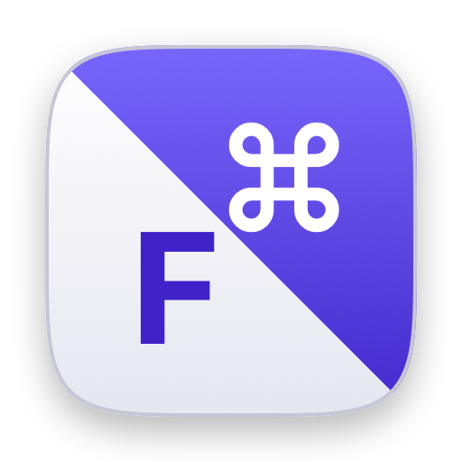

# TapLayer

**Make any keyboard QMK-compatible — mouse included.**

Home row mods, layers, and a pointer you drive from the letters. It all runs on
the Mac, not in firmware, so any keyboard works: your MacBook's, or the tablet
you're typing from. Hold `a s d f j k l ;` for modifiers; tap them and you get
the letter, exactly as before.

**[Download the latest release](https://github.com/js-commit/taplayer-mac/releases/latest)** ·
**[taplayer site](https://js-commit.github.io/taplayer-mac/)** · macOS 13+ · free

`No network code` · `Records nothing you type` · `One permission` ·
`No driver, no root` · `Native Swift, under 1 MB`

---

## Leave the laptop at home

Remote into your Mac from an iPad or an Android tablet over
[Jump Desktop](https://jumpdesktop.com/) and your whole desktop fits in a bag
that weighs nothing. The catch is always the keyboard: Android won't send `⌘` or
`Esc` at all, half of the folio cases out there have no trackpad, and nothing is
where your hands expect it.

TapLayer fixes all of that from the Mac side: no firmware, no config file, no
companion app on the tablet. It works the same on the MacBook's own keyboard, so
you learn it once.

### Android eats your keys: Command *and* Escape come back

Android never forwards Command, so `⌘Tab`, `⌘C` and `⌘Space` are dead, and it
claims `Esc` for its own Back button before Jump Desktop ever sees it. TapLayer
hands both back: Command moves to `f` and `j`, the tablet's Alt key is rewritten
into Command, and Caps Lock, which Android *does* forward, becomes Escape.
iPadOS is better about this. Not much.

### No trackpad in the bag: a free mouse, hiding in the letters

Hold `Esc` and the letters turn into a pointer: `ijkl` moves it, `f` and `r`
click, `y` and `h` scroll. A whole mouse, on hardware you already own, which
matters if you carry a
[Smart Keyboard Folio](https://support.apple.com/en-us/108361) or any of the
countless compact boards without a trackpad. One less thing to reach for.

### Firmware you can't touch: home row mods without QMK or ZMK

Home row mods are normally a firmware feature, which rules out almost every
folio case, tablet keyboard and cheap 60% on the market. TapLayer does the work
on the Mac, so the keyboard never knows: a board that will never see a firmware
update behaves like one that just got flashed.

### Reading, not typing: the arrow keys become a scroll wheel

Hold `` ` `` and the arrows scroll instead, horizontal included, gathering speed
the longer you hold. Long articles and long diffs go past without your hand
leaving the keyboard.

### Rolls, and why they don't break it

Fast typing rolls fingers across the home row, and a naive hold-for-modifier
scheme turns that into garbage. TapLayer waits out a short hold and watches for
the roll before it commits, so ordinary prose types normally. Capitalising
several words in a row is the one case that still feels slower, since every
capital waits out the hold; the real `⇧` keys are still right there.

## Why not kanata or Karabiner

They're good tools and far more configurable than this one. The catch is the
layer they work at: they remap physical keyboards by grabbing the HID device
underneath, but keystrokes from a tablet never touch HID. Jump Desktop injects
them further up, so kanata never sees them, and no amount of configuring changes
that. TapLayer sits at the layer they actually arrive on.

| | TapLayer | kanata |
|---|---|---|
| Keys from an iPad or Android over Jump Desktop | works | never sees them |
| The Mac's own keyboards | works | works |
| What you install | one app | kanata, plus Karabiner's DriverKit virtual keyboard driver |
| Permissions to grant | Accessibility | a driver extension, Input Monitoring, and Accessibility — the last two through a foreground priming dance, because a root daemon cannot raise its own prompts |
| Runs as | you, one process | root, as a LaunchDaemon |
| Setup time | a minute | an afternoon, honestly |
| Custom keymaps | not yet — coming | yes, and it's genuinely good at it |

If you only ever type on the Mac's built-in keyboard and want a fully custom
layout, kanata is worth the afternoon. If you want home row mods to just be
there, on whatever keyboard you're holding, this is the smaller thing.

## Native Swift. 400 KB. Idles at zero.

One process, written in Swift against AppKit and CoreGraphics, the frameworks
already sitting on your Mac. No Electron, no Node, no Python, no bundled
runtime, nothing vendored: `otool -L` on the binary lists Apple's own libraries
and nothing else.

The whole app is a **400 KB binary** in a **936 KB bundle**. It idles at **0.0%
CPU**, holds about 30 MB of memory (most of it framework pages it shares with
every other app), and runs no daemon, no helper process and no driver alongside
itself. Nothing polls. Between your keystrokes, it's asleep.

It has to be. It sits in the path of every key you press, all day, on a machine
you're also trying to work on.

## Privacy

**No network. No keystroke logging.** There is no networking code in the app at
all, so nothing can be uploaded even by accident, and the ability to record what
you type isn't compiled into this build. The log holds events (connections,
layer changes, errors), never text, and you can open and read it yourself from
the menu. Accessibility is the only permission it asks for: no root, no full disk
access, no screen recording. Modifiers stand down entirely whenever macOS signals
a secure input field.

## The keymap

Fixed for now: one opinionated default set, nothing to configure and nothing to
get wrong. Custom layouts are the next thing being built.

**Home row** — tap for the letter, hold for the modifier:

| Hold | You get |
|---|---|
| `a` `;` | Shift |
| `s` `l` | Control |
| `d` `k` | Option |
| `f` `j` | Command |

**Hold `Space`** — navigation:

| Key | Does |
|---|---|
| `i` `j` `k` `l` | ↑ ← ↓ → |
| `y` `h` | Page up / page down |
| `u` `o` | Home / End |
| `e` `n` | Return / Escape |
| `f` `g` `r` `c` | `/` `?` `'` `_` |
| number row | F1–F12 (`-` and `=` are F11 and F12) |

**Hold `Esc`** — mouse:

| Key | Does |
|---|---|
| `i` `j` `k` `l` | Move the pointer (accelerates while held) |
| `f` `r` | Left click / right click (double and triple clicks work) |
| `y` `h` | Scroll up / down |
| `q` `w` | Browser back / forward |
| arrows, delete | Same thing, if your keyboard has the cluster |

**Hold `` ` ``** — arrow keys become a scroll wheel, horizontal included.

**Odds and ends:**

| | |
|---|---|
| Option + tap `Space` | Delete the word behind the cursor |
| Caps Lock (Android) | Becomes Escape, since Android keeps the real one for Back. Tap it for Escape, hold it for the mouse layer |
| Alt (Android) | Becomes Command, automatically, for Android sessions only |
| `Left Ctrl` + `Space` + `Esc` | Kill switch. Stops the engine from anywhere, including from the tablet |

## Install

1. Open the dmg, drag **TapLayer** to Applications, launch it. The same split
   keycap shows up in the menu bar in miniature, with a green dot beside it
   whenever it's remapping a keyboard. No window, no Dock icon.
2. Tick **TapLayer** in System Settings → Privacy & Security → **Accessibility**.
   Nothing is remapped until you do. It starts working the instant you flip the
   switch, no restart needed.
3. Typing from a tablet works immediately. For this Mac's own keyboard, turn on
   **Remap Local Keyboards** in the menu.

It adds itself as a login item on first launch; turn that off in the same menu.

---

Free and unsupported, shared in case it's useful to someone else. The source
isn't published.
